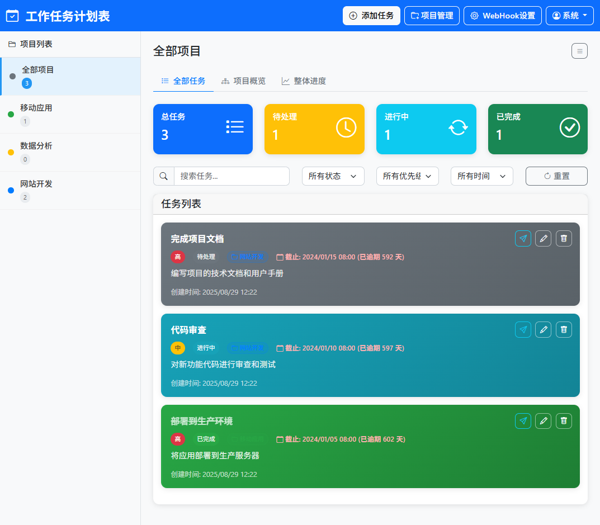

# 工作任务计划表

一个基于 Node.js 和 Bootstrap v5 的现代化工作任务管理应用，提供完整的任务增删改查功能。





## 功能特性

- ✅ **任务管理**: 创建、编辑、删除任务
- 📊 **统计面板**: 实时显示任务统计信息
- 🔍 **搜索筛选**: 按标题、描述、状态、优先级筛选任务
- 📅 **截止日期**: 设置任务截止日期，自动提醒逾期任务
- 🎨 **现代化UI**: 基于 Bootstrap v5 的响应式设计
- 📱 **移动端适配**: 完美支持移动设备
- ⚡ **实时更新**: 无需刷新页面即可更新任务状态

## 技术栈

- **后端**: Node.js + Express
- **前端**: HTML5 + CSS3 + JavaScript (ES6+)
- **UI框架**: Bootstrap v5
- **图标**: Bootstrap Icons
- **数据存储**: SQLite 数据库

## 快速开始

### 1. 安装依赖

```bash
npm install
```

### 2. 启动应用

```bash
# 生产环境
npm start

# 开发环境（自动重启）
npm run dev
```

### 3. 访问应用

打开浏览器访问: http://localhost:8765

## 打包为可执行文件

本项目支持使用 pkg 打包为独立的可执行文件，无需安装 Node.js 即可运行。

### 安装 pkg
```bash
npm install -g pkg
```

### 打包命令

#### 打包为 Windows 可执行文件
```bash
npm run build-win
```

#### 打包为多平台可执行文件
```bash
npm run build-all
```

打包后的文件将在 `dist` 目录中：
- `task-manager.exe` (Windows)
- `task-manager-macos` (macOS)
- `task-manager-linux` (Linux)

### 使用可执行文件

1. 运行对应平台的可执行文件
2. 程序会自动在当前目录创建 `data` 文件夹存储数据库
3. 打开浏览器访问 `http://localhost:8765`
4. 数据库文件位于 `data/tasks.db`

### 打包配置

项目已配置好 pkg 打包设置：
- 包含所有静态资源文件
- 包含 SQLite 二进制文件
- 支持多平台打包
- 自动处理数据库路径

## 项目结构

```
work_task/
├── package.json          # 项目配置和依赖
├── server.js             # Express 服务器
├── database.js           # SQLite 数据库操作
├── tasks.db              # SQLite 数据库文件（自动生成）
├── .gitignore            # Git 忽略文件
├── README.md             # 项目说明
└── public/               # 静态文件目录
    ├── index.html        # 主页面
    ├── style.css         # 自定义样式
    └── script.js         # 前端JavaScript
```

## API 接口

### 获取所有任务
```
GET /api/tasks
```

### 创建新任务
```
POST /api/tasks
Content-Type: application/json

{
  "title": "任务标题",
  "description": "任务描述",
  "priority": "high|medium|low",
  "dueDate": "2024-01-15"
}
```

### 更新任务
```
PUT /api/tasks/:id
Content-Type: application/json

{
  "title": "更新的标题",
  "description": "更新的描述",
  "priority": "high|medium|low",
  "status": "pending|in-progress|completed",
  "dueDate": "2024-01-15"
}
```

### 删除任务
```
DELETE /api/tasks/:id
```

## 使用说明

### 添加任务
1. 点击导航栏的"添加任务"按钮
2. 填写任务信息（标题为必填项）
3. 选择优先级和状态
4. 设置截止日期（可选）
5. 点击"保存"按钮

### 编辑任务
1. 在任务卡片上点击编辑按钮（铅笔图标）
2. 修改任务信息
3. 点击"保存"按钮

### 删除任务
1. 在任务卡片上点击删除按钮（垃圾桶图标）
2. 在确认对话框中点击"删除"

### 搜索和筛选
- 使用搜索框按标题或描述搜索任务
- 使用状态下拉菜单筛选特定状态的任务
- 使用优先级下拉菜单筛选特定优先级的任务

## 自定义配置

### 修改端口
在 `server.js` 中修改 PORT 变量或设置环境变量：
```bash
PORT=8080 npm start
```

### 数据库说明
应用使用 SQLite 数据库存储任务数据：
- 数据库文件：`tasks.db`（首次运行时自动创建）
- 表结构：包含任务的所有字段和索引
- 自动初始化：首次启动时会创建表并插入示例数据
- 数据持久化：所有任务数据都会永久保存

### 扩展其他数据库
如需使用其他数据库，可以修改 `database.js` 文件：
- MongoDB
- PostgreSQL
- MySQL

## 开发说明

### 添加新功能
1. 后端 API 在 `server.js` 中添加路由
2. 前端功能在 `public/script.js` 中添加函数
3. 样式修改在 `public/style.css` 中进行

### 代码规范
- 使用 ES6+ 语法
- 遵循 RESTful API 设计
- 保持代码简洁和可读性

## 许可证

MIT License

## 贡献

欢迎提交 Issue 和 Pull Request！
